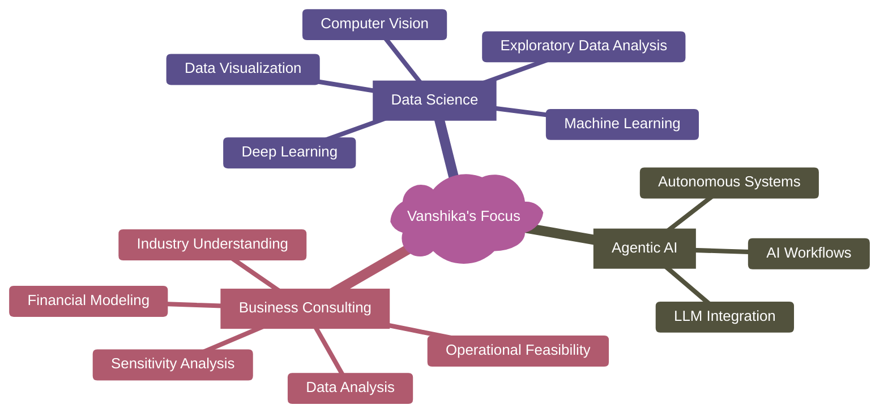

# 👋 Hey! Welcome to my GitHub 
<p align="center">  </p>  

<div align="center">
  
  [](https://www.linkedin.com/in/vanshika-goel-1223b3317?utm_source=share&utm_campaign=share_via&utm_content=profile&utm_medium=ios_app)
  [](mailto:goelvanshika0204@gmail.com)
  
</div>


## 🚀 About Me

```python
class VanshikaGoel:

    def __init__(self):
        self.name = "Vanshika Goel"
        self.degree = "B.Tech Computer Science Engineering"
        self.specialization = "Data Science"
        
        self.primary_domains = [
            "Machine Learning Systems",
            "AI-driven Analytics",
            "Retrieval-Augmented Generation (RAG)",
            "Business Analytics",
            "Predictive Modeling"
        ]
        
        self.core_strengths = {
            "Languages": ["Python", "SQL"],
            "Frameworks": ["Scikit-Learn", "Streamlit", "SentenceTransformers"],
            "Tools": ["Power BI", "Git", "Plotly"]
        }

        self.mindset = "Design structured AI systems that are measurable, explainable, and scalable"

    def what_i_work_on(self):
        return [
            "📊 Transforming raw data into actionable insights",
            "🧠 Building explainable AI models",
            "📈 Developing dashboard-driven decision systems",
            "⚙️ Optimizing ML pipelines for real-world deployment"
        ]

    def future_direction(self):
        return [
            "Exploring Advanced NLP & LLM-based systems",
            "Building production-grade AI tools",
            "Contributing to impactful open-source ML projects"
        ]

```

<div align="center">

### Areas of Interest


</div>

## 📊 GitHub Analytics

<div align="center">
  
</div>

<div align="center">
  
</div>

<div align="center">
  
</div>

## 🎯 Current Focus Areas



## 🤝 Let's Connect and Collaborate!

  
  I'm always excited to connect with fellow developers, data enthusiasts, and anyone passionate about technology!
  
  **Open for:**
  - 🤝 Collaboration on interesting projects
  - 💡 Discussing new ideas and innovations
  - 🎓 Learning opportunities and mentorship
  - 🚀 Open source contributions
  
  <br/>
  

<div align="center">
  
  **"Build structured systems. Measure everything. Explain clearly. Improve continuously.**
  
</div>

<div align="center">
  
  
  ⭐️ From [Vanshika Goel](https://github.com/vanshikagoel02)
</div>
